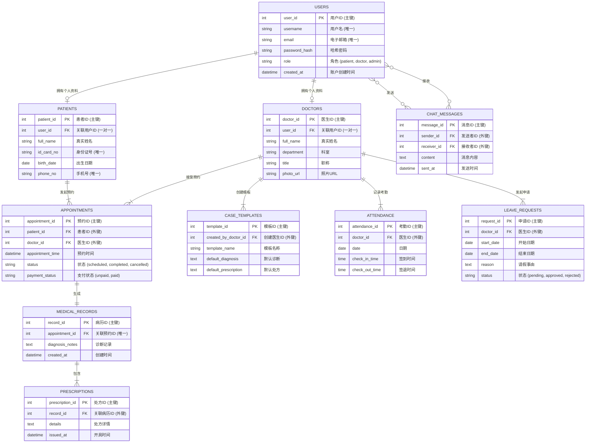
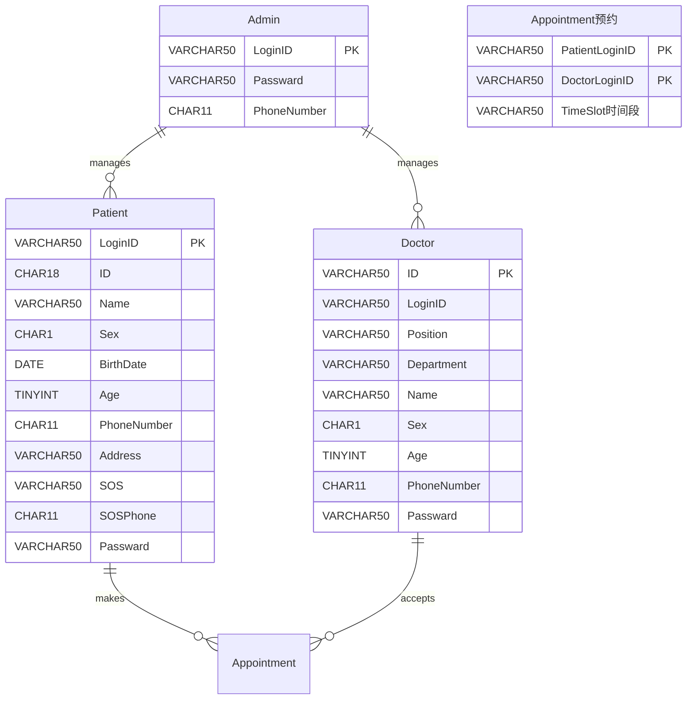

ER图

页面
| 模块     | 字段                                           | 数据类型 / 约束        |
|----------|------------------------------------------------|------------------------|
| 患者信息 | 姓名                                           | 字符串                 |
| 患者信息 | 身份证号                                       | 18位数字               |
| 患者信息 | 性别                                           | 选项：男 / 女          |
| 患者信息 | 出生年月                                       | 年月日                 |
| 患者信息 | 年龄                                           | 自动识别               |
| 患者信息 | 联系方式（手机号）                             | 11位数字               |
| 患者信息 | 家庭住址                                       | 字符串                 |
| 患者信息 | 紧急联系人（家属、监护人）姓名                 | 字符串                 |
| 患者信息 | 紧急联系人（家属、监护人）的联系方式（手机号） | 11位数字               |

| 模块     | 字段               | 数据类型 / 约束   |
|----------|--------------------|-------------------|
| 医生信息 | 工号               | 字符串
| 医生信息 | 姓名               | 字符串            |
| 医生信息 | 性别               | 选项：男 / 女     |
| 医生信息 | 年龄               | 计算              |
| 医生信息 | 联系方式（手机号） | 11位数字          |
| 医生信息 | 所在科室           | 字符串            |
| 医生信息 | 医生职务           | 字符串            |

| 模块（流程）     | 字段                     | 数据类型 / 约束 |
|------------------|--------------------------|------------------|
| 挂号（患者操作） | 患者姓名                 | 自动匹配         |
| 挂号（患者操作） | 患者年龄                 | 自动匹配         |
| 挂号（患者操作） | 医生科室（先）           | 选择             |
| 挂号（患者操作） | 可选医生（在所在科室选） | 选择             |
| 挂号（患者操作） | 预约的时间段             | 选择             |

数据结构---用户
