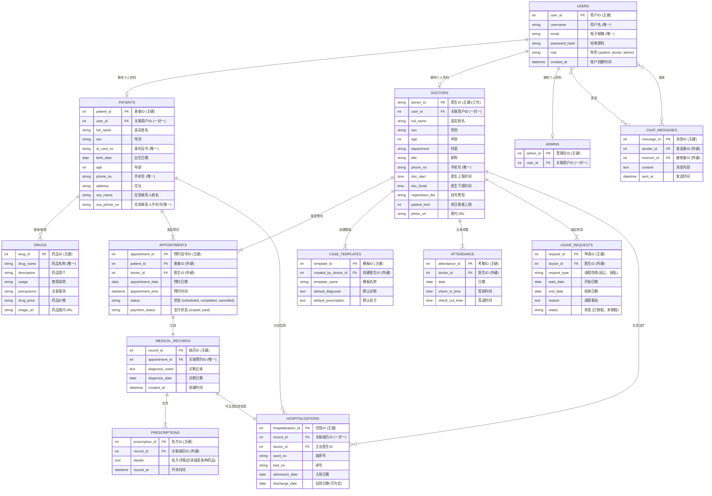

```mermaid
erDiagram
    USERS {
        int user_id PK "用户ID (主键)"
        string username "用户名 (唯一)"
        string email "电子邮箱 (唯一)"
        string password_hash "哈希密码"
        string role "角色 (patient, doctor, admin)"
        datetime created_at "账户创建时间"
    }

    ADMINS {
        int admin_id PK "管理员ID (主键)"
        int user_id FK "关联用户ID (一对一)"
    }

    PATIENTS {
        int patient_id PK "患者ID (主键)"
        int user_id FK "关联用户ID (一对一)"
        string full_name "真实姓名"
        string sex "性别"
        string id_card_no "身份证号 (唯一)"
        date birth_date "出生日期"
        int age "年龄"
        string phone_no "手机号 (唯一)"
        string address "住址"
        string sos_name "应急联系人姓名"
        string sos_phone_no "应急联系人手机号(唯一)"
    }

    DOCTORS {
        string doctor_id PK "医生ID (主键)(工号)"
        int user_id FK "关联用户ID (一对一)" 
        string full_name "真实姓名"
        string sex "性别"
        int age "年龄"
        string department "科室"
        string title "职称"
        string phone_no "手机号 (唯一)"
        time doc_start "医生上班时间"
        time doc_finish "医生下班时间"
        string registration_fee "挂号费用"
        int patient_limit "单日患者上限"
        string photo_url "照片URL"
    }

    APPOINTMENTS {
        int appointment_id PK "预约挂号ID (主键)"
        int patient_id FK "患者ID (外键)"
        int doctor_id FK "医生ID (外键)"
        date appointment_date "预约日期"
        datetime appointment_time "预约时间"
        string status "状态 (scheduled, completed, cancelled)"
        string payment_status "支付状态 (unpaid, paid)"
    }

    MEDICAL_RECORDS {
        int record_id PK "病历ID (主键)"
        int appointment_id FK "关联预约ID (唯一)"
        text diagnosis_notes "诊断记录"
        date diagnosis_date "诊断日期"
        datetime created_at "创建时间"
    }

    HOSPITALIZATIONS {
        int hospitalization_id PK "住院ID (主键)"
        int record_id FK "关联病历ID (一对一)"
        int doctor_id FK "主治医生ID"
        string ward_no "病房号"
        string bed_no "床号"
        date admission_date "入院日期"
        date discharge_date "出院日期(可为空)"
    }


    PRESCRIPTIONS { 
        int prescription_id PK "处方ID (主键)"
        int record_id FK "关联病历ID (外键)"
        text details "处方详情(应该就是各种药品)"
        datetime issued_at "开具时间"
    }

    DRUGS {
        int drug_id PK "药品ID (主键)"
        string drug_name "药品名称 (唯一)"
        string description "药品简介"
        string usage "使用说明"
        string precautions "注意事项"
        string drug_price "药品价格"
        string image_url "药品图片URL"
    }

    CHAT_MESSAGES {
        int message_id PK "消息ID (主键)"
        int sender_id FK "发送者ID (外键)"
        int receiver_id FK "接收者ID (外键)"
        text content "消息内容"
        datetime sent_at "发送时间"
    }

    CASE_TEMPLATES {
        int template_id PK "模板ID (主键)"
        int created_by_doctor_id FK "创建医生ID (外键)"
        string template_name "模板名称"
        text default_diagnosis "默认诊断"
        text default_prescription "默认处方"
    }

    ATTENDANCE {
        int attendance_id PK "考勤ID (主键)"
        int doctor_id FK "医生ID (外键)"
        date date "日期"
        time check_in_time "签到时间"
        time check_out_time "签退时间"
    }

    LEAVE_REQUESTS {
        int request_id PK "申请ID (主键)"
        int doctor_id FK "医生ID (外键)"
        string request_type "请假性质(因公、因私)"
        date start_date "开始日期"
        date end_date "结束日期"
        text reason "请假事由"
        string status "状态 (已销假、未销假)"
    }

    USERS ||--o| PATIENTS : "拥有个人资料"
    USERS ||--o| DOCTORS : "拥有个人资料"
    USERS ||--o| ADMINS  : "拥有个人资料"
    PATIENTS ||--o{ DRUGS : "搜索/查看"
    USERS }o--o{ CHAT_MESSAGES : "发送"
    USERS }o--o{ CHAT_MESSAGES : "接收"
    
    PATIENTS ||--|{ APPOINTMENTS : "发起预约"
    DOCTORS ||--|{ APPOINTMENTS : "接受预约"
    DOCTORS ||--|{ CASE_TEMPLATES : "创建模板"
    DOCTORS ||--|{ ATTENDANCE : "记录考勤"
    DOCTORS ||--|{ LEAVE_REQUESTS : "发起申请"

    APPOINTMENTS ||--|| MEDICAL_RECORDS : "生成"
    MEDICAL_RECORDS ||--|{ PRESCRIPTIONS : "包含"
    
    MEDICAL_RECORDS ||--|| HOSPITALIZATIONS : "可生成住院信息"
    DOCTORS ||--o{ HOSPITALIZATIONS : "负责治疗"
    PATIENTS ||--o{ HOSPITALIZATIONS : "对应住院"

```