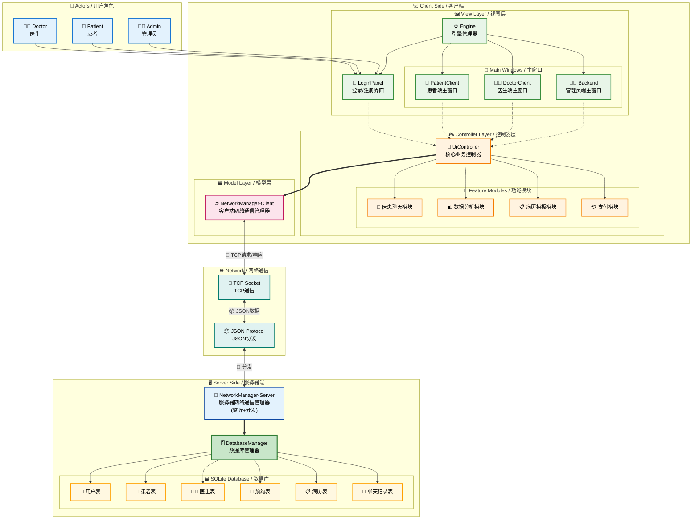
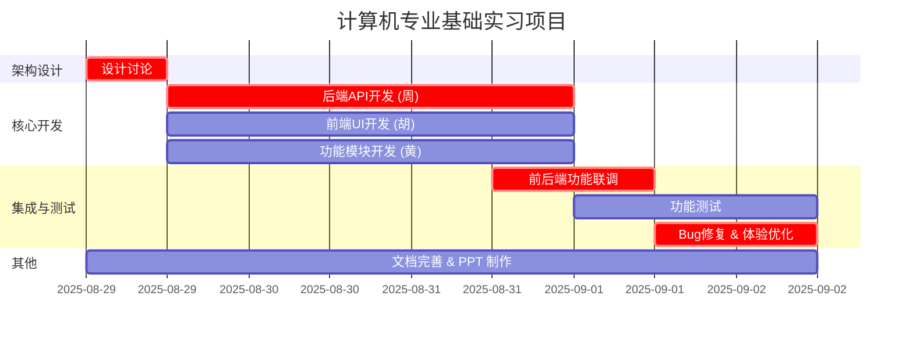

# cpp-qt-medical-system

北京理工大学 23 级计科大三小学期计算机专业基础实习大作业

## 目录

1. [项目概述](#1-项目概述)
2. [团队分工](#2-团队分工)
3. [模块划分与任务分配](#3-模块划分与任务分配)
4. [架构设计与接口约定](#4-架构设计与接口约定)
5. [初步时间计划](#5-初步时间计划)
6. [开发规范](#6-开发规范)
7. [可供参考的资料](#7-可供参考的资料)

---

## 0. TODO

> 随时更新需要处理的事务

### 📅 8/30

1. [ ] 当前的项目中，数据库尚且存放在本地，无法实现数据共享，需要更改为 C/S 架构，将数据库转移到服务器端
2. [ ] 黄奕晨的模块需要修改以集成到现有代码当中，当前还是独立的部分，在各方面与当前代码不兼容

### 📅 8/31

1. [ ] 更新了[架构图](#31-总体模块视图)，主要是添加了服务器端和网络通信层部分，尚待实现。实现思路：
   - 将 databaseManager 迁移到服务器端，可以直接复用原有的代码
   - 在 databaseManager 与 uiController 之间新增一个 networkManager 模块，用于处理网络通信。使用 TCP 通信，使用 JSON 数据格式。客户端与服务器端均需要添加相关模块来处理信息收发与处理
   - 修改 databaseManager, uiController 与 networkManager 的接口，在此之前两者之间是直接调用，现在需要通过 networkManager 来调用
2. [x] 补充科室的表格，医生表的科室变成外键

### 📅 9/1

1. [x] 在数据库的 `Doctors` 表中添加了 `description` 字段，用于存储医生的个人简介
2. [ ] 进行初步测试，填写 Issue
3. [x] 生成一些假的数据，填充到数据库当中去

> 说明：将主目录下的 `medical_system.db` 覆盖到工程文件夹 (`build-*/`) 下面的 `debug` 目录下去，替换掉原来的数据库文件

### 📅 9/2

1. [ ] 重新分工，给周鑫与黄奕晨分配更多的任务，胡艺镭则专注于 UI 方面 (Issue 里面较多涉及)

---

## 1. 项目概述

### 1.1 项目目标

9 月 2 日中午之前，参照[项目说明书](./docs/00[新]项目说明书-智慧医疗管理系统V2.pdf)完成 [1.3](#13-最终需要产出的成果) 中的所有内容，并在有余力的情况下完成我们新增的需求以获取加分。

### 1.2 技术栈

- **开发环境:** Ubuntu 18.04
- **框架:** Qt 5.12.8
- **编译器:** GCC 7.5.0
- **编程语言:** C++
- **数据库:** SQLite

### 1.3 最终需要产出的成果

- **可执行程序:** 打包好的应用程序，用于路演展示用。
- **项目源码:** 所有源代码和资源。
- **项目文档:** 校发的 10 个左右的项目文档资料。

---

## 2. 团队分工

### 2.1 角色分配

| 姓名 | 角色 | 主要职责 |
| :--- | :--- | :--- |
| **左逸龙** | 文档 / TL | 组织协调、进度跟踪、文档整合、辅助开发 |
| **刘兆钰** | 文档 / 测试 / SMCL | 文档攥写、功能测试、UI 测试 |
| **周鑫** | **后端 & 架构主力** | 数据库设计、后端业务逻辑、核心API接口实现、管理员后端(在时间允许的情况下) |
| **胡艺镭** | **前端 & UI 主力** + PRL | 患者端/医生端/管理员端所有UI设计与实现、用户交互逻辑、CR (Code Review) |
| **黄奕晨** | **功能模块 & 算法主力** | 医患聊天、病历模板、数据分析与可视化等独立功能模块开发 |

> 需要申明的是，分工并不是死板的，我们更多的是线下开发，因此在开发过程当中可以灵活调整，也可以互相帮助。

### 2.2 沟通机制

- **线下讨论:** 在教室坐在一起，可以随时交流。
- **微信聊天:** 其他时候使用微信聊天。
- **腾讯会议:** 根据实际情况不定时召开会议 (可能没有)。

---

## 3. 模块划分与任务分配

### 3.1 总体模块视图

### 3.2 详细任务分配表

> 参考 [12-04需求理解一览表.xls](./docs/12-04需求理解一览表.xls) 的需求理解来完成，但是不要参考它的分工。详细分工如下：

#### 👨‍💻 **周鑫 (后端 & 架构主力)**

| 职责分类 | 详细任务 | 相关需求 ID |
| :--- | :--- | :--- |
| **数据库** | 1. **设计与实现:** 根据讨论情况，设计并创建所有数据表。   2. **数据接口:** 编写`DatabaseManager`类，提供所有原子化的数据库CRUD操作。 | 17, 18, 19, 20, 21, 22, 23 |
| **核心架构** | 1. **控制器设计:** 定义`UiController.h`的全部接口，作为系统唯一逻辑入口。   2. **后端服务实现:** 将所有后端逻辑封装在`UiController`的`.cpp`文件中。 | 27 |
| **用户与账户** | 1. **注册后端:** 校验邮箱唯一性，密码加密存储，创建新用户。   2. **登录后端:** 验证用户凭据，返回登录状态和用户信息。   3. **密码策略:** 实现密码复杂度校验逻辑。   4. **找回密码后端:** 处理邮箱/验证码验证逻辑。 | 1 (后端), 2 (后端), 29, 30 (后端) |
| **业务逻辑** | 1. **个人信息后端:** 提供接口以更新和获取用户（医/患）的详细信息。   2. **挂号预约后端:** 处理挂号请求，校验医生排班，原子化更新预约数。   3. **病历/医嘱后端:** 提供接口以创建、查询和更新病历、医嘱、处方。   4. **预约提醒后端:** 提供接口查询用户24小时内的预约。 | 3 (后端), 4 (后端), 5 (后端), 6, 7, 8, 9, 14, 15, 16 (后端), 32, 33 (后端), 34 |
| **管理员模块** | 1. **后台接口:** 实现对所有用户的增、删、改、查管理接口。 | 45 (后端) |
| **服务器模块 (新增)** | 参考 [TODO](#-831) 当中的说明 | 新增模块 |

#### 🎨 **胡艺镭 (前端 & UI 主力)**

| 职责分类 | 详细任务 | 相关需求 ID |
| :--- | :--- | :--- |
| **UI设计与实现** | 1. **界面开发:** 负责**所有**窗口和自定义控件的UI设计与实现(.ui文件+代码)。包括登录/注册、医/患/管主界面、信息编辑、挂号、病历、考勤等所有可见界面。 | 贯穿所有UI相关需求 |
| **前端交互** | 1. **信号与槽:** 将所有UI控件的信号（如按钮点击）连接到`UiController`的槽函数。   2. **数据绑定:** 调用`UiController`的接口获取数据，并将其展示在UI界面上。   3. **状态处理:** 根据`UiController`返回的结果（成功/失败/具体错误），在UI上给用户合适的反馈（弹窗、提示信息等）。 | 贯穿所有UI相关需求 |
| **患者端流程** | 1. **核心流程:** 实现从注册、登录到查看医生、挂号、查看病历、医嘱、处方的完整用户流程的UI。   2. **预约提醒:** 在主界面加载时调用后端接口，并用一个优雅的、非侵入式的方式（如通知栏）展示提醒信息。 | 1, 2, 3, 4, 5, 6, 7, 8, 9, 14, 15, 16 |
| **医生端流程** | 1. **核心流程:** 实现医生登录、编辑信息、查看预约患者、管理病历、考勤打卡的完整流程的UI。 | 30, 31, 32, 33, 34, 37, 38, 39, 40, 41 |
| **管理员流程** | 1. **管理界面:** 实现用户列表的展示、搜索，以及添加/重置/禁用用户的操作界面。 | 45 |
| **CR(Code Review)** | 1. **代码审查:** 对其他两位同学的 PR 进行审查，确保代码质量。 | 贯穿所有代码 |

#### 🧩 **黄奕晨 (功能模块 & 算法主力)**

| 职责分类 | 详细任务 | 相关需求 ID |
| :--- | :--- | :--- |
| **医患沟通** | 1. **聊天逻辑:** 实现`ChatMessage`数据结构，以及通过`UiController`发送和接收消息的逻辑。   2. **聊天UI集成:** 与胡艺镭协作，将聊天逻辑嵌入到聊天窗口UI中，实现消息的实时显示。   3. **语音识别:** 实现调用系统API或一个简单的模拟功能，将语音输入转换为文字并填入输入框。 | 10, 43, 44 |
| **数据分析** | 1. **图表生成:** 使用Qt Charts或其他方式，获取`UiController`提供的数据，并动态生成基础数据分析图表（如折线图）。   2. **远端数据采集:** **模拟**一个智能心电仪API调用，获取预设的JSON或XML数据，并进行解析和分析。 | 35, 36 |
| **效率功能** | 1. **药品搜索:** 实现一个本地药品搜索功能，根据用户输入在预设的药品列表中进行筛选并展示结果。   2. **病历模板:** 实现调用`UiController`接口获取病历模板，并将其内容填充到当前病历编辑界面的逻辑。 | 12, 42 |
| **支付模块** | 1. **线上支付:** **模拟**微信支付流程。点击支付后，显示一个二维码图片，并提供一个“我已支付”按钮来模拟回调，以继续流程。 | 13 |
| **其他服务** | 1. **邮箱验证:** 实现邮件发送功能以验证邮箱或找回密码。   2. **网关与状态服务:** 提供网关与状态监控服务。   3. **缓存机制:** (可选，若时间允许) 为高频读取的数据（如科室列表）实现简单缓存。 | 24, 25, 26 |

---

### 无法实现的需求

以下是一些经过分析后发现不切实际或无法完成的需求，进行了一定的修改。

| 需求 ID | 需求名称 | 无法完成/不合理的原因 | 方案 |
| :--- | :--- | :--- | :--- |
| **28** | **分布式部署云服务器** | 这属于运维(DevOps)范畴，需要购买云服务器、配置环境、学习部署流程，远超本次开发实习的范围和时间限制。 | **目标:** 交付一个可运行的程序。 **方案:** 提供一个打包好的本地桌面应用程序（Windows的`.exe`或Linux的可执行文件）及安装说明。 |
| **13** | **线上支付** | 对接真实的微信支付API需要企业资质认证、复杂的SDK集成和后端回调处理，无法在短期内完成。 | **目标:** 体验支付流程。 **方案:** **模拟支付**。显示二维码图片并提供一个按钮来手动确认支付成功。 |
| **36** | **远距数据采集分析** | 我们没有真实的智能心电仪硬件或其配套的API服务。 | **目标:** 展示处理外部API数据的能力。 **方案:** **模拟API**。创建一个函数或读取本地文件，使其返回一段预设好的、模仿心电仪数据的JSON字符串，然后对此数据进行解析和展示。 |

---

## 4. 架构设计与接口约定

### 4.1 数据库设计 (ER图)

详情请参考[另外一个文档](./ER.md)

### 4.2 新架构核心设计

基于改进后的架构图，系统采用**三层架构**设计：

#### 🏗️ **C/S架构设计**
- **客户端 (Client Side)**: 包含完整的MVC架构，负责用户界面和业务逻辑处理
- **网络通信层 (Network Communication)**: 实现TCP/IP通信协议和数据传输
- **服务器端 (Server Side)**: 独立的服务器应用，负责业务逻辑和数据存储

#### ⚙️ **核心组件**
- **Engine引擎**: 单例模式的应用程序管理器，负责窗口生命周期和系统启动
- **UiController**: 单例模式的业务控制器，客户端逻辑的唯一入口
- **DatabaseManager**: 单例模式的数据访问层，适配C/S架构
- **NetworkManager**: 网络通信管理器，处理客户端-服务器通信

#### 🎯 **MVC架构实现**
- **Model层**: DatabaseManager + NetworkManager，负责数据访问和网络通信
- **View层**: 所有UI组件，包括主窗口、子页面和功能界面
- **Controller层**: UiController + 各功能模块，处理业务逻辑和用户交互

### 4.3 接口约定与通信协议

#### 📡 **网络通信协议**
- **传输协议**: TCP/IP Socket通信
- **数据格式**: JSON格式的标准化数据包
- **认证机制**: 基于Token的会话管理
- **错误处理**: 标准化的错误码和异常处理机制

#### 🔗 **接口设计原则**
- **UiController接口**: 所有业务逻辑通过UiController单例访问
- **异步通信**: 所有网络请求采用异步模式，避免UI阻塞
- **信号槽机制**: 使用Qt信号槽实现组件间的松耦合通信
- **数据传递**: 使用 `QVariantMap`, `QVariantList` 等通用数据结构

#### 🛠️ **开发协作约定**
- **后端接口**: **周鑫** 负责所有UiController接口的设计和实现
- **UI集成**: **胡艺镭** 负责UI与控制器的信号槽连接
- **功能模块**: **黄奕晨** 负责功能模块与UiController的接口对接
- **测试规范**: 所有接口变更需要通过代码审查和集成测试

---

## 5. 初步时间计划

> 实际情况可能会有所变化，但大致上会遵循这个时间计划。

---

## 6. 开发规范

### 6.1 Git 工作流

- **分支命名:**
  - 功能开发: `feature/user-login` 或 `feat/chat-module`
  - Bug修复: `fix/login-crash`
  - ......
- **提交信息:**
  - 尽量遵循 [Conventional Commits](https://www.conventionalcommits.org/) 规范。格式: `<type>: <subject>`
- **合并流程:**
  - 禁止直接 `push` 到 `main` 分支，容易导致代码冲突。
  - 所有代码通过 **Pull Request (PR)** 合并，需要至少一人进行 **Code Review**。

### 6.2 代码风格

- **命名规范:**
  - 类名: `UpperCamelCase` (e.g., `PatientModel`)
  - 函数/变量名: `lowerCamelCase` (e.g., `getUserName`)
  - 私有成员变量: 加 `m_` 前缀 (e.g., `m_userName`)
  - 命名规范，含义清晰
- **缩进规范**
  - 统一采用 `Allman Style`，主要是左大括号需要下放到下一行
  - 统一使用四个空格的缩进长度，如果 `Tab` 缩进长度不同的可能需要调整一下
- **注释要求**
  - **复杂的布局、逻辑部分**需要有注释进行适当解释
  - **别人需要用到的函数与方法**需要给出清晰的注释说明，例如函数功能、需要怎样的参数、返回值是什么等等
- **其他的规范可以后续继续补充**

---

## 7. 可供参考的资料

> 有的代码可以直接照抄过来，前人有较多具体实现。

- [一个同样也是 Qt + Cpp 开发的医院管理系统，推荐参考](https://github.com/OmerJauhar/Hospital-Management-System-HMS-QT-Software-OOP-C-)
- [使用 Qt + Cpp 开发的实时聊天系统，推荐参考](https://github.com/vRFEducation/qtchatapplication)
- 23级其他组正在进行当中的项目：
  - [同样也是医疗系统，流程图画得比较清晰，可以参考](https://github.com/xialinguo/hospital)
  - [工业现场远程专家支持系统，代码写得很快，我们可以参考文档、编码流程等部分](https://github.com/wyyalhz/RemoteExpert)
  - [软工专业的，看仓库命名也像是医疗系统，不知道具体要求有没有不同](https://github.com/wdyy20041223/smart_medical_care)
  - [目前为空，等待后续动作](https://github.com/Dingnuooo/bit2025xxq)
- 往年学长学姐们的项目：
  - 医疗系统 (**⚠️需要重点关注⚠️**)：
    - [观察历史记录，可以看出开发了较长的时间，最终代码质量也较好，尤其是向聊天系统当中加入 AI 聊天的部分值得借鉴](https://github.com/BottleOfErie/SmartHospital)
    - [在代码架构、 UI 设计等方面均可参考](https://github.com/danielpfeiffer123/Smart_Healthcare_System)
    - [使用了 qml 来设计 UI，可以参考](https://github.com/Garryyangck/BIT-qt-medical)
  - 车载系统 (22级)：
    - [含有聊天模块，可以参考其他文档的攥写](https://github.com/YYT-0901/CS-BIT-INFORMATION/tree/master/5semester%20%E5%A4%A7%E4%B8%89%E4%B8%8A/%E8%AE%A1%E7%AE%97%E6%9C%BA%E4%B8%93%E4%B8%9A%E5%9F%BA%E7%A1%80%E5%AE%9E%E4%B9%A0)
    - [同样也是车载系统](https://github.com/xChang1021x/BIT/tree/main/Y3S1/%E8%AE%A1%E7%AE%97%E6%9C%BA%E4%B8%93%E4%B8%9A%E5%9F%BA%E7%A1%80%E5%AE%9E%E4%B9%A0)
    - [同样也是车载系统，文档写得比较详细](https://github.com/bit-angi/CarCentralSys)
    - [同样也是车载系统](https://github.com/paomian2333/carControl)
  - 通讯系统 (更早一些的)：
    - [Client](https://github.com/muxinyu1/q-chater-client) + [Server](https://github.com/muxinyu1/q-chater-server) 的架构
    - [Client](https://github.com/loujuch/client) + [Server](https://github.com/loujuch/server)
    - [Client+Server](https://github.com/zx1316/linpop-lan-im)
